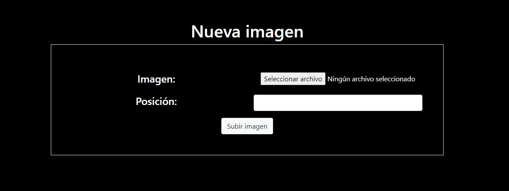
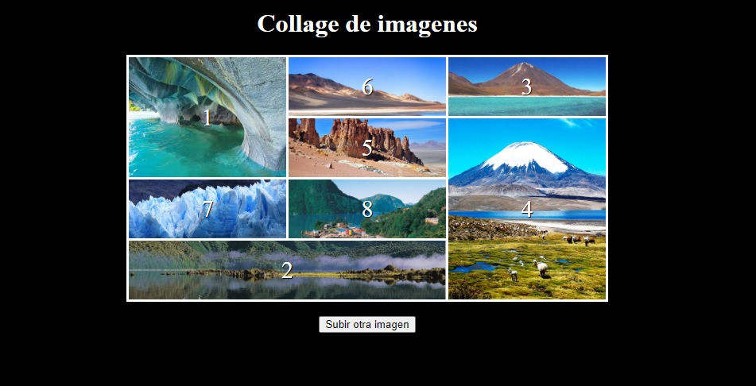
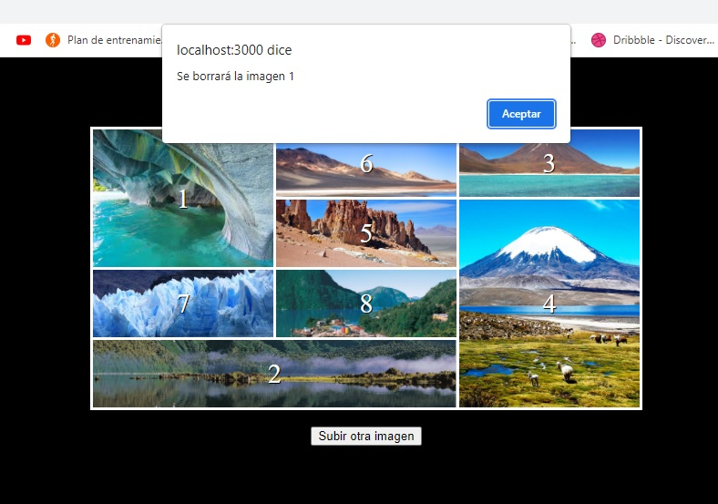

# Desafío - Collage de imágenes

Crear un servidor con Express y el paquete express-fileupload para almacenar las imágenes que estarán dentro del collage

## Comenzando 🚀

_Estas instrucciones te permitirán obtener una copia del proyecto en funcionamiento en tu máquina local para propósitos de desarrollo y pruebas._

- $ cd ../path/to/the/file
- $ npm install
- $ node server.js

### Requerimientos

1. Integrar express-fileupload a Express.
2. Definir que el límite para la carga de imágenes es de 5MB.
3. Responder con un mensaje indicando que se sobrepasó el límite especificado.
4. Crear una ruta POST /imagen que reciba y almacene una imagen en una carpeta
   pública del servidor. Considerar que el formulario envía un payload con una
   propiedad “position”, que indica la posición del collage donde se deberá mostrar la
   imagen.
5. Crear una ruta GET /deleteImg/:nombre que reciba como parámetro el nombre de
   una imagen y la elimine de la carpeta en donde están siendo alojadas las imágenes.
   Considerar que esta interacción se ejecuta al hacer click en alguno de los números
   del collage.

### Implementaciones adicionales

- Se crea alert que avisa cuando una imagen será eliminada
- Si en la ruta del collage se presiona una cuadro vacío (sin imagen), se despliega un HTML con un aviso que indica
  que hay un error al tratar de eliminar la imagen. El HTML tiene un botón para volver al collage.

##### Las siguientes imágenes representan las interacciones que debe tener el sitio web una vez terminado el desafío.

###### Así debería verse el formulario

###### Así debería verse el formulario

###### Alert que se despliega al eliminar una imagen

## Construido con 🛠️

- [nodeJS](https://nodejs.org/en/)

#### Usando las librerías:

- [Express](https://expressjs.com/es/)
- [express-fileupload](https://www.npmjs.com/package/express-fileupload)
- [fs](https://nodejs.org/api/fs.html)

## Autores ✒️

- **Arlene Santos**
- **Eric Leiva**
- **Diego Madariaga**
- **Mario Montenegro**
